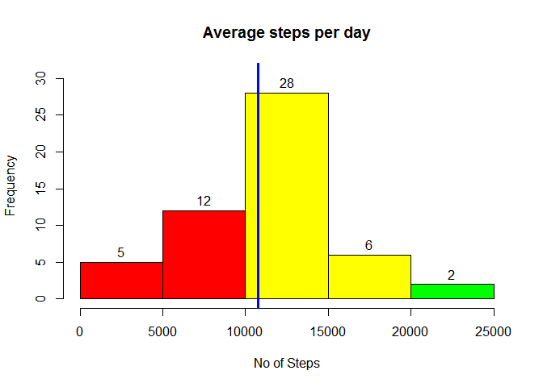
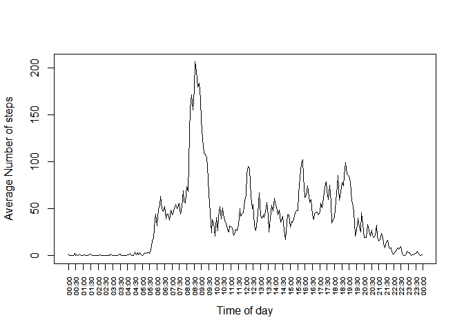
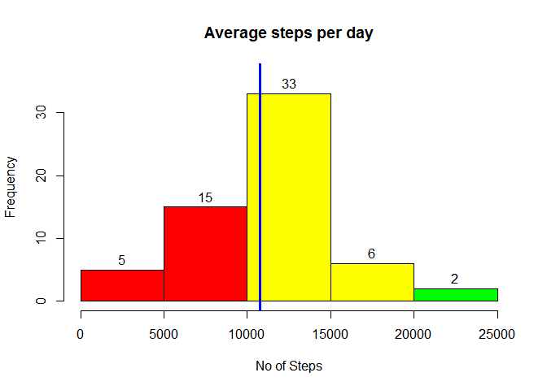

# Reproducible Research: Peer Assessment 1


## Loading and preprocessing the data

```r
# extract the supplied file from compressed format into the current folder
#unzip("activity.zip")

# read the csv file from current directory
fileName<- "activity.csv"
activityData <- read.csv(fileName,header=TRUE,na.strings="NA")
```

## Mean total number of steps taken per day

```r
# Compute and summarize by date the total number of steps
stepCountPerDay<-aggregate(steps~date, data=activityData, sum)

# Compute the median of total steps for each day
medianOfStepsEachDay<-round(median(stepCountPerDay$steps))

# Compute the average number of steps for each day 
averageStepsEachDay<-round(mean(stepCountPerDay$steps))

# Prepare histogram
histgm <- hist(stepCountPerDay$steps, plot=FALSE)

# Determine total number of breaks in the histogram
breakCount <- abs(histgm$breaks)

# Determine the max number of counts (the frequency) - to be used for extending the y-axis
maxCount <- max(histgm$counts)

# determine the 25th and 75th percentiles just to color the histogram accodingly
quantiles<-quantile(histgm$breaks, c(.25,.75))

# draw the plot and color the bars as per the percentiles computed earlier
plot(histgm, ylim=c(0,maxCount*1.10), labels=TRUE,main="Average steps per day",xlab="No of Steps",
     col=ifelse(histgm$breaks < quantiles[1], "red", 
                ifelse(histgm$breaks > quantiles[2], "green","yellow")))

# Draw a reference line to show the average number of steps per day     
abline(v = averageStepsEachDay, col = "blue", lwd = 3)
```

 
With an average count of steps daily being __10766__, one can see that number of observations with step count higher than average is greater than those below average. This is a good sign! Interestingly the median value of total steps over all the days is __10765__ is a very close to the average number of steps each day!


## What is the average daily activity pattern?

```r
######################

# Load required libraries
library(lubridate)
```

```
## Warning: package 'lubridate' was built under R version 3.1.2
```

```r
library(stringr)

# read the csv file from current directory
fileName<- "activity.csv"
activityData <- read.csv(fileName,header=TRUE,na.strings="NA")


# Summarize by interval the average number of steps during that interval over all the days
AvgStepsPerInterval<-aggregate(steps~interval, data=activityData, mean)

# Convert the interval into a POSIX Date Time format
AvgStepsPerInterval$interval <- strptime(sprintf("%04d",AvgStepsPerInterval$interval),"%H%M")

# Prepare x and y axis values
xData<-AvgStepsPerInterval$interval
yData<-AvgStepsPerInterval$steps

# Plot the data without x axis lables
plot(xData, yData, type = "l", ylab="Average Number of steps", xlab = "Time of day", xaxt = "n")

# Prepare labels for x-axis to display the ticks at 30 min intervals
# Credits: Stack Overflow for ideas on how to prepare the labels
#          http://stackoverflow.com/questions/6592627/r-plot-specify-number-of-time-tickmarks-time-date-equivalent-to-pretty
#
tseq <- seq(from = round(xData[1], "hours"),
            to = xData[1] + ceiling(difftime(tail(xData, 1), head(xData, 1), 
                                         units = "hours")),
            by = "30 min")

# draw the x axis labels in HH:MM format
axis.POSIXct(side = 1, x = xData, at = tseq,
             labels = format(tseq, format = "%H:%M"), las = 2,cex.axis=.60,font=2)

maxAverageSteps<-round(max(AvgStepsPerInterval$steps))

timeIntervalForMaxSteps <- strftime(AvgStepsPerInterval[AvgStepsPerInterval$steps == max(AvgStepsPerInterval$steps),1],"%r")

abline(v = AvgStepsPerInterval[AvgStepsPerInterval$steps == max(AvgStepsPerInterval$steps),1], col = "blue", lwd = 1)
```

 

The __08:35:00 AM__ interval shows as having the highest average number of steps, __206__ across all days

## Imputing missing values

The supplied data set had in all __2304__ missing values. Hence I decided to impute these values using following approach:

1. I have made an assumption that the activity performer has a set schedule of activites for a given weekday and time interval and sticks to this scheduled fairly consistently:
2. Determine the weekday for observation based on the supplied date. E.g. Mon, Tue, Wed etc.
3. Compute the average number of steps for a given interval supplied and the weekday. So the idea is to compute , for example, average number of steps a performer takes 4:30PM on each Tuesday. 
4. I would then use the average number of steps on a weekday at given interval to fill in the missing values in a copy of original data set (which had missing values)
5. Now I get a complete data set for comparison


```r
# This code is about preparing a new data set with missing values filled in based on approach described above
#
# load the required libraries
library(plyr)
```

```
## Warning: package 'plyr' was built under R version 3.1.2
```

```
## 
## Attaching package: 'plyr'
## 
## The following object is masked from 'package:lubridate':
## 
##     here
```

```r
library(dplyr)
```

```
## Warning: package 'dplyr' was built under R version 3.1.2
```

```
## 
## Attaching package: 'dplyr'
## 
## The following objects are masked from 'package:plyr':
## 
##     arrange, count, desc, failwith, id, mutate, rename, summarise,
##     summarize
## 
## The following objects are masked from 'package:lubridate':
## 
##     intersect, setdiff, union
## 
## The following object is masked from 'package:stats':
## 
##     filter
## 
## The following objects are masked from 'package:base':
## 
##     intersect, setdiff, setequal, union
```

```r
# introduce a column which will identify the weekday
activityData<-mutate(activityData,weekday=strftime(date,"%A"))

# Compute average number of steps for a given weekday and time interval over all the dates
# So essentially we are computing average number of steps at a given time interval on all Mondays, Tuesdays etc..

avgStepsWeekdayInterval<-aggregate(steps~strftime(date,"%A")+interval,data=activityData, mean)

# Let's name the column so it is consistent with the one in activityData dataframe
colnames(avgStepsWeekdayInterval)[1]<-"weekday"

# Round the average value to eliminate decimal positions
avgStepsWeekdayInterval$steps<-round(avgStepsWeekdayInterval$steps)

# This function performs following
# for a given weekday and interval it returns the average no of steps for that weekday and interval from 
# the previously prepared data frame called avgStepsWeekdayInterval.
getAvgStepsForWeekdayInterval <- function(weekday, interval, ... ){
        avgSteps<-avgStepsWeekdayInterval[avgStepsWeekdayInterval$weekday==weekday & avgStepsWeekdayInterval$interval==interval,3]
        return(avgSteps)
}

# Prepare 2nd data frame from original so we can use that to fill in missing values
completeData<-activityData

# In this data set now go through every row and where value of steps is missing, fill it using the
# function prepared earlier

for (i in 1:nrow(completeData)){
        #fill no of steps only if it is missing, i.e. NA
        if (is.na(completeData[i,1])) {
                completeData[i,1]<-getAvgStepsForWeekdayInterval(completeData[i,4],completeData[i,3])
        }
        
}
```
At this point we will see that in the new complete data set there are __0__ missing values. *If you see anything other than zero, then that is a problem!*


```r
# Compute and summarize by date the total number of steps
stepCountPerDay<-aggregate(steps~date, data=completeData, sum)

# Compute the median of total steps for each day
medianOfStepsEachDayCD<-round(median(stepCountPerDay$steps))

# Compute the average number of steps for each day 
averageStepsEachDayCD<-round(mean(stepCountPerDay$steps))

# Prepare histogram
histgm <- hist(stepCountPerDay$steps, plot=FALSE)

# Determine total number of breaks in the histogram
breakCount <- abs(histgm$breaks)

# Determine the max number of counts (the frequency) - to be used for extending the y-axis
maxCount <- max(histgm$counts)

# determine the 25th and 75th percentiles just to color the histogram accodingly
quantiles<-quantile(histgm$breaks, c(.25,.75))

# draw the plot and color the bars as per the percentiles computed earlier
plot(histgm, ylim=c(0,maxCount*1.10), labels=TRUE,main="Average steps per day",xlab="No of Steps",
     col=ifelse(histgm$breaks < quantiles[1], "red", 
                ifelse(histgm$breaks > quantiles[2], "green","yellow")))

# Draw a reference line to show the average number of steps per day     
abline(v = averageStepsEachDay, col = "blue", lwd = 3)
```

 

With missing values imputed we see a slightly different picture. The average number of steps each day moved from __10766__ to __10821__ a net change of __55__, while the median value of total steps moved from __10765__ to __11015__ a net change of __250__


## Are there differences in activity patterns between weekdays and weekends?
